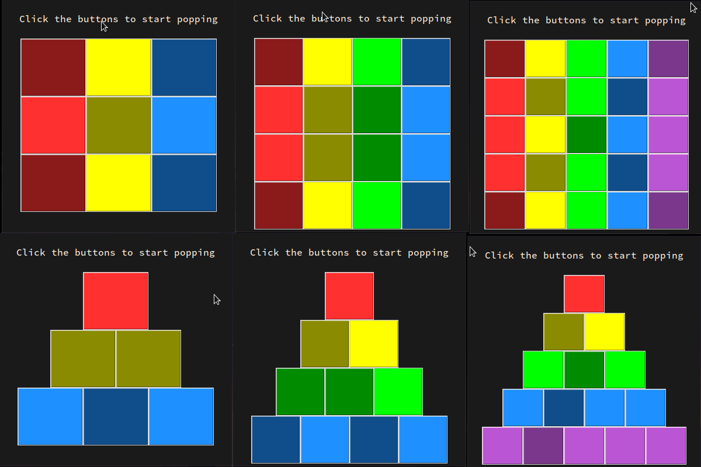

# Pop-It
A Pop It game written in tkinter

# Features:-

- Light Weight
- Cross Platform/Architecture(works on x64 , i686)
- Beautiful/Minimal UI
- Made with X11 Colors(no external colors)
- 3x3 , 4x4 , 5x5 Game Mode
- 6 Pop It Toys(3 Trianglular and 3 Squares)
- 2 Games made through Pop It:-

**Pluck:-** A luck tester game testing how lucky you are

**Pange:-** A game containing of 3 challenges and solving them pops the game)

# System Requirements:-

- Disk Space:- 32MB
- Python:- 3.6+
- OS:- Windows 7+ , Linux `glibc 2.35=<`

# Look:-

# How to play?

Just like in a normal pop it you pop the circles instead here you need to click the button and the button usually becomes dark indicating it is popped. I could not completely replicate the UI but i tried my best to replicate pop it

# Web Version:-

Thanks @AdvikAggarwal for making it to the web, he will upload very soon
